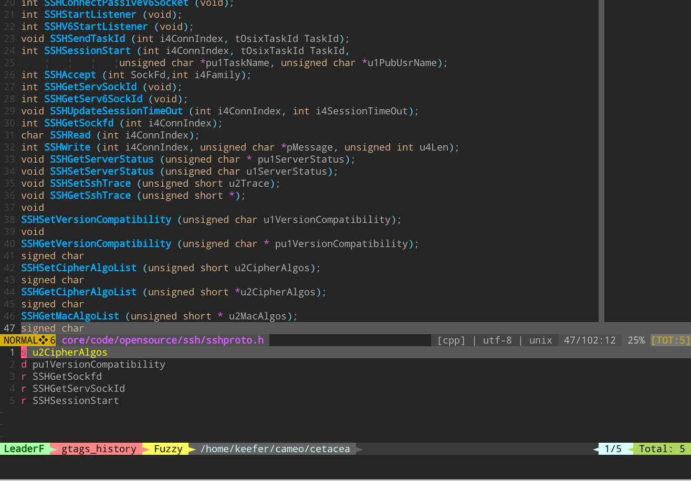

leaderf-gtags-history
====================

Record leaderf gtags search histories.



## Installation

with [vim-plug](https://github.com/junegunn/vim-plug)

```vim
Plug 'Yggdroot/LeaderF'
Plug 'keeferwu/LeaderF-gtags-history'
```

## Features

Provide related LeaderF command:

```vim
:Leaderf! gtags_history              # show leaderf gtags search history
:Leaderf! gtags_history --cache      # list and delete leaderf gtags database cache
```

## Keymaps

| keymap | desc |
|--------|------|
| `<leader>ga` |  Show input text which want to definition or reference|
| `<leader>gd` |  Show <cword> locations of definitions.|
| `<leader>gr` |  Show <cword> reference to a symbol which has definitions.|
| `<leader>gs` |  Show <cword> reference to a symbol which has no definition.|
| `<leader>gg` |  Show all lines which match to the <cword>.|

You can disable the default keymaps by:

```VimL
let g:leader_gtags_nomap = 1
```

and define your new maps like:

```VimL

map <silent> <leader>fa <Plug>LeaderfGtagsInternel
map <silent> <leader>fd <Plug>LeaderfGtagsDefinition
map <silent> <leader>fr <Plug>LeaderfGtagsReference
map <silent> <leader>fs <Plug>LeaderfGtagsSymbol
map <silent> <leader>fg <Plug>LeaderfGtagsGrep
```


Dependency
----------

[Yggdroot/LeaderF](https://github.com/Yggdroot/LeaderF)
